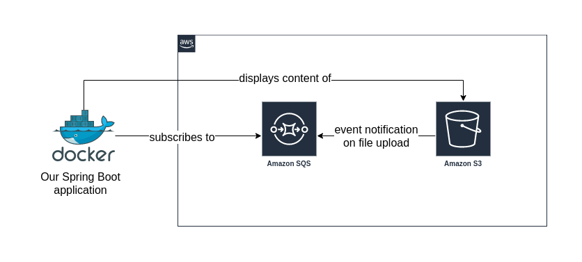

```groovy
plugins {
    id 'java'
    id 'org.springframework.boot' version '2.7.5'
    id 'io.spring.dependency-management' version '1.0.15.RELEASE'
}

group = 'com.example'
version = '0.0.1-SNAPSHOT'
//sourceCompatibility = '17'

repositories {
    mavenCentral()
}

dependencies {
    implementation 'org.springframework.boot:spring-boot-starter-thymeleaf'
    implementation 'org.springframework.boot:spring-boot-starter-web'
    developmentOnly 'org.springframework.boot:spring-boot-devtools'
    testImplementation 'org.springframework.boot:spring-boot-starter-test'
    implementation 'org.springframework.cloud:spring-cloud-starter-aws'
    implementation 'org.springframework.cloud:spring-cloud-starter-aws-messaging'
    implementation 'org.springframework.cloud:spring-cloud-starter-aws-parameter-store-config'

}

tasks.named('test') {
    useJUnitPlatform()
}

```

- ``spring-boot-starter-thymeleaf``: Spring Boot starter for Thymeleaf
- ``spring-boot-starter-web``: Spring Boot starter for web applications
- ``spring-boot-devtools``: Spring Boot DevTools adds development-time features to your application.
- ``spring-cloud-starter-aws``: Spring Cloud AWS provides integration with Amazon Web Services.
- ``spring-cloud-starter-aws-messaging``: Spring Cloud AWS Messaging
- ``spring-cloud-starter-aws-parameter-store-config``: Spring Cloud AWS Parameter Store Config

<br/>

----

<br/>


```yaml
cloud:
  aws:
    region:
      auto: true
    credentials:
      access-key: KEY
      secret-key: SECRET
      
```
- ``cloud.aws.region.auto``: AWS Region
- ``cloud.aws.credentials.access-key``: AWS Access Key
- ``cloud.aws.credentials.secret-key``: AWS Secret Key